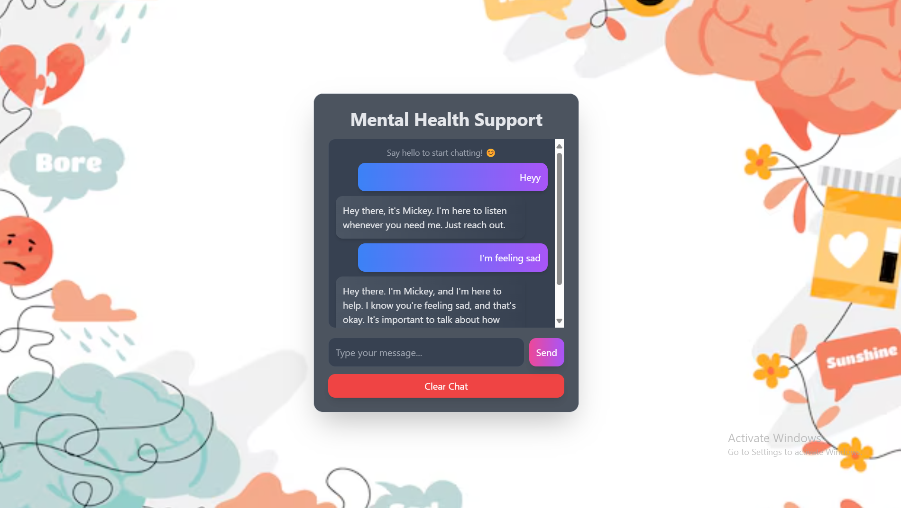

## MENTAL HEALTH SUPPORT AI

It is a mental health support AI chatbot which is designed to assist users with their mental well being. It provides empathetic conversations, coping strategies, self care tips and emotional support.It offer a safe, non-judgemental space for users to express themselves.

## Team Name

Technologic's
## Team Members

Aiswarya P,
Archa Sajeevan

## Project Description

Our mental health support AI chatbot is dedicated to promoting emotional well-being through thoughtful and compassionate interactions. It offers a safe, judgment-free space where users can openly share their feelings, receive self-care guidance, explore coping strategies, and find emotional support whenever they need it.

✅ Technology Used:
* HTML, CSS, Tailwind CSS (for styling and layout)
* JavaScript (for interactivity)

✅ Frontend Responsibilities:

* Displays the chatbot UI.
* Captures user input from the text field.
* Sends messages to an API (your backend should handle this).
* Displays bot responses dynamically.

* The code is directly calling Google’s Gemini API from the frontend

## Screenshots

